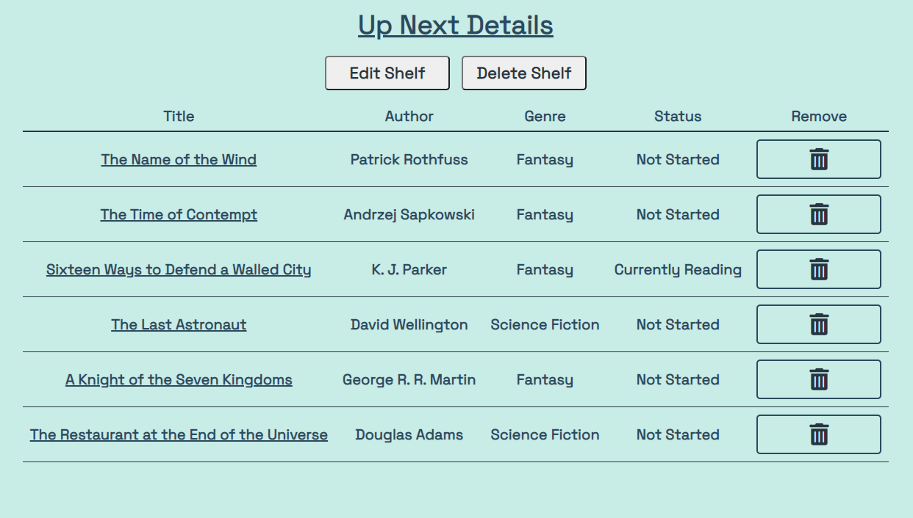

# **Readrs**

 When I moved recently, I had to travel with about 7 boxes full of books. At various points, I have tried to catalogue all of my books in excel or google spreadsheets, but they're not always easy to use. I wanted to create an app that I would like to use, and that others could get use out of.

The purpose of this application is to provide a way for users to keep a catalogue of their books, and create "shelves" to categorize them.

***
## Deployed App Link on Heroku:  
https://readrs.herokuapp.com/

***

## Trello Board
https://trello.com/b/jpT5RMCl/unit-2-project-workspace

***

## Screenshots

***

## Technologies Used
HTML, CSS, JavaScript, Node.js, Express, MongoDB, Mongoose, Passport, Google OAuth 

***

### Citations
Trash icon from [Font Awesome](fontawesome.com).  
Fonts: "Cinzel", "Space Grotesk" from Google Fonts

***

## Next Steps (icebox items)
- Reordering Shelves
- Upload Cover Images
- Sorting by the Headings on the Index page
- Editing Notes

